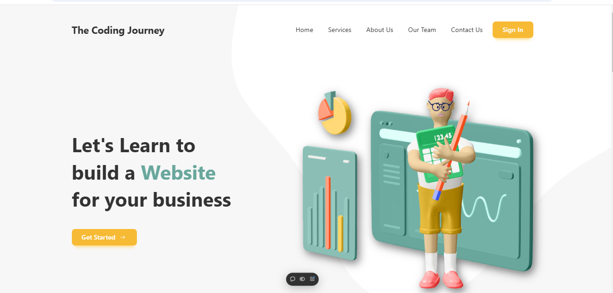

# E-Learning Landing Page  [Live Url](https://nex-gen-agency-client.vercel.app) 

This project is a responsive e-learning landing page built using **React**, **Tailwind CSS**, **React Icons**, and **Framer Motion**. The application showcases an attractive, smooth UI with animated components to enhance user experience.

## Preview


## Features

- **Hero Section**: A welcoming banner with a brief introduction.
- **Services Section**: Displays various services or courses offered.
- **Subscription Section**: Allows users to subscribe to newsletters or updates.
- **Footer**: Provides useful links, contact info, and social media icons.

## Technologies Used

- **React**: A JavaScript library for building user interfaces.
- **Tailwind CSS**: Utility-first CSS framework for fast UI styling.
- **React Icons**: Icons used throughout the UI.
- **Framer Motion**: For smooth animations and transitions.

## Installation and Setup

1. **Clone the repository:**

   ```bash
   git clone https://github.com/your-username/e-learning-landing-page.cd e-learning-landing-page
   npm install
   npm start

🤝 Contributing
Contributions are welcome! Please feel free to submit a pull request or open an issue if you have suggestions.

Happy coding! 😊

